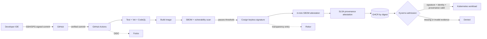

# ChainShield: Automated Supply Chain Security

[](https://github.com/YOUR_GITHUB_OWNER/YOUR_GITHUB_REPOSITORY/actions/workflows/pull-request.yml)
[](https://github.com/YOUR_GITHUB_OWNER/YOUR_GITHUB_REPOSITORY/actions/workflows/supply-chain.yml)

ChainShield is a working DevSecOps reference project that creates a cryptographically verifiable chain from a signed Git commit to the exact container image admitted into Kubernetes. It combines **Git commit signing**, **GitHub Actions**, **in-toto attestations**, **SLSA provenance**, **Sigstore Cosign**, **Rekor**, **SPDX SBOMs**, **Kyverno**, and **OPA Gatekeeper**.

> **Precise security claim:** no tool can prove that code is bug-free or that a trusted developer endpoint is uncompromised. This project makes unauthorized changes detectable, binds build evidence to an immutable image digest, and blocks deployment when the configured signature or provenance policy cannot be verified.

## What this project demonstrates

- Signed commits are required before code enters the trusted build path.
- CI tests, vets, formats, scans, and builds a small Go service.
- The container is identified by an immutable `sha256` digest rather than a mutable tag.
- Sigstore performs keyless signing with GitHub OIDC, Fulcio certificates, and Rekor transparency logging.
- An SPDX SBOM is attached as a signed in-toto attestation.
- GitHub creates signed SLSA provenance in the in-toto Statement format.
- Kyverno fails closed and denies images without the expected signature and provenance.
- OPA/Conftest tests the Kubernetes manifest before merge.
- An optional Gatekeeper policy enforces trusted registry and digest pinning as defense in depth.

## Architecture



## Trust chain

| Stage | Evidence | Enforcement point | Failure result |
|---|---|---|---|
| Developer → GitHub | SSH/GPG commit signature | PR and push workflows | Build stops |
| Source → build | Repository, workflow, commit SHA | GitHub-hosted workflow identity | Provenance records the invocation |
| Build → image | OCI digest | Build and verification steps | Tags are not trusted alone |
| Image → metadata | SPDX SBOM and SLSA provenance | Sigstore/in-toto attestations | Missing evidence fails verification |
| Registry → cluster | Signature identity, OIDC issuer, Rekor record, provenance | Kyverno admission controller | Pod admission is denied |
| Manifest → review | Registry, digest, hardening rules | OPA/Conftest | Pull request check fails |

## Repository layout

```text
.
├── .github/workflows/        # PR checks and trusted release pipeline
├── .githooks/                # Local pre-push signed-commit guard
├── app/                      # Minimal Go API and tests
├── deploy/base/              # Hardened, digest-pinned Kubernetes workload
├── docs/                     # Architecture, signing, threat model, operations
├── policies/
│   ├── kyverno/              # Cryptographic signature/provenance admission
│   ├── gatekeeper/           # Optional registry and digest constraints
│   └── opa/                  # Shift-left Conftest rules
├── provenance/               # in-toto/SLSA explainer and sample statement
├── scripts/                  # Configure, pin, verify, and tamper-test helpers
├── Dockerfile                # Rootless distroless multi-stage build
├── GITHUB_DESCRIPTION.md     # Copy-ready GitHub About and Markdown text
└── README.md
```

## Prerequisites

Required for the full demonstration:

- Git and a GitHub repository
- Go 1.24+ for local development
- Docker or another OCI builder
- A Kubernetes 1.27+ cluster and `kubectl`
- Helm 3 to install Kyverno
- Cosign 2.x+ and GitHub CLI for local verification
- Conftest for local OPA checks

The GitHub workflow installs its own build, SBOM, scan, and signing tooling.

## Quick start

### 1. Create and configure the repository

Extract this project, create an empty GitHub repository, and run:

```bash
cd chainshield-devsecops
./scripts/configure.sh YOUR_GITHUB_OWNER YOUR_GITHUB_REPOSITORY

git init
git branch -M main
git remote add origin https://github.com/YOUR_GITHUB_OWNER/YOUR_GITHUB_REPOSITORY.git
```

The configuration script replaces the owner/repository placeholders in workflows, policies, manifests, badges, module metadata, and docs.

### 2. Configure signed commits

SSH signing is the simplest option for most GitHub users:

```bash
git config --global gpg.format ssh
git config --global user.signingkey ~/.ssh/id_ed25519.pub
git config --global commit.gpgsign true
git config --global tag.gpgSign true
```

Add the matching public key to **GitHub → Settings → SSH and GPG keys → New SSH key**, choose **Signing key**, and follow [the complete signing guide](docs/commit-signing.md).

Install the local guard:

```bash
./scripts/install-git-hooks.sh
```

### 3. Enable GitHub protections

In the repository settings:

1. Create a branch ruleset for `main`.
2. Require a pull request and at least one approval.
3. Require the `Verify signed commits`, `Test and vet`, `Test Kubernetes policy`, and `CodeQL` checks.
4. Require signed commits and block force pushes.
5. Give Actions read/write workflow permissions as needed; the release job explicitly requests only the permissions it uses.
6. If your plan supports it, enable artifact attestations and make the GHCR package public or configure cluster pull credentials.

### 4. Push the first signed commit

```bash
git add .
git commit -S -m "feat: initialize ChainShield supply chain"
git push -u origin main
```

The trusted workflow will refuse an unsigned or GitHub-unverified commit. On success, its job summary prints the immutable image reference:

```text
ghcr.io/YOUR_GITHUB_OWNER/YOUR_GITHUB_REPOSITORY@sha256:<digest>
```

### 5. Verify the published evidence

```bash
./scripts/verify-image.sh \
  ghcr.io/YOUR_GITHUB_OWNER/YOUR_GITHUB_REPOSITORY@sha256:<digest> \
  YOUR_GITHUB_OWNER \
  YOUR_GITHUB_REPOSITORY
```

The helper independently checks:

1. the Cosign image signature and exact workflow identity;
2. the signed SPDX SBOM attestation;
3. GitHub's signed SLSA build provenance.

For an image built from a release tag, pass a fourth argument such as `refs/tags/v1.0.0`.

### 6. Install Kyverno and the admission policies

```bash
helm repo add kyverno https://kyverno.github.io/kyverno/
helm repo update
helm upgrade --install kyverno kyverno/kyverno \
  --namespace kyverno \
  --create-namespace \
  --wait

kubectl apply -k policies/kyverno
kubectl get clusterpolicy
```

The Kyverno policy trusts only signatures/attestations whose Fulcio identity matches this repository's `supply-chain.yml` workflow on `main` or a semantic-version tag, and whose issuer is GitHub Actions OIDC.

### 7. Pin and deploy the verified digest

```bash
./scripts/set-image-digest.sh sha256:<digest>
kubectl apply -k deploy/base
kubectl rollout status deployment/chainshield -n supply-chain-demo
kubectl port-forward service/chainshield 8080:80 -n supply-chain-demo
```

In another terminal:

```bash
curl http://localhost:8080/
curl http://localhost:8080/healthz
```

If GHCR is private, create an `imagePullSecret` in `supply-chain-demo` and attach it to the workload's service account before deployment.

### 8. Prove that unsigned content is blocked

```bash
./scripts/tamper-test.sh YOUR_GITHUB_OWNER YOUR_GITHUB_REPOSITORY
```

The script attempts to admit a matching but unsigned image. Success means Kubernetes rejects the Pod. If it is admitted, the script exits non-zero and tells you to inspect the Kyverno installation/policy.

## How the release pipeline works

The workflow at `.github/workflows/supply-chain.yml` uses this order deliberately:

1. **Verify source:** query GitHub's commit verification record and stop if the triggering commit is unsigned or invalid.
2. **Test source:** run unit tests, the race detector, `go vet`, and formatting checks.
3. **Build by digest:** build a rootless distroless image and push it to GHCR. The image is not trusted yet.
4. **Generate SBOM:** describe the exact image contents in SPDX JSON.
5. **Scan:** fail on high/critical findings according to the configured Grype threshold. A failed image can remain in the registry, but it stays unsigned and is therefore undeployable under policy.
6. **Sign:** use GitHub's short-lived OIDC identity with Cosign. No long-lived private signing key is stored in repository secrets.
7. **Attest:** sign the SPDX predicate and create SLSA v1 provenance using the in-toto Statement model.
8. **Verify:** immediately verify the signature, SBOM attestation, and GitHub provenance before publishing the digest summary.

## in-toto, SLSA, and Sigstore roles

These technologies solve different parts of the problem:

- **in-toto** defines the signed statement envelope that binds a subject digest to claims about that artifact.
- **SLSA provenance** defines the build claim: builder identity, invocation, source, and resolved dependencies.
- **Cosign** signs the image and the SBOM attestation and stores them alongside the OCI artifact.
- **Fulcio** issues the short-lived certificate that binds the ephemeral signing key to the GitHub workflow identity.
- **Rekor** provides a tamper-evident transparency log entry.
- **Kyverno** verifies the evidence during Kubernetes admission and fails closed.

See [`provenance/README.md`](provenance/README.md) for the data model.

## Policy-as-Code options

### Kyverno — default cryptographic enforcement

`policies/kyverno/verify-supply-chain.yaml` contains two independent fail-closed policies because an image signature and an attestation are separate evidence types:

- `verify-chainshield-signature` verifies the Cosign keyless image signature, digest, issuer, workflow identity, and Rekor entry.
- `verify-chainshield-provenance` verifies the GitHub Sigstore bundle, SLSA v1 predicate, and expected GitHub workflow build type.

### OPA/Conftest — shift-left manifest checks

The pull-request workflow evaluates `deploy/base` with `policies/opa/kubernetes.rego`. It denies a deployment that uses a mutable tag, an untrusted repository, privilege escalation, or a writable root filesystem.

```bash
make policy-test
```

### Gatekeeper — optional structural defense in depth

The Gatekeeper example requires the trusted repository and a `sha256` digest:

```bash
kubectl apply -f policies/gatekeeper/constraint-template.yaml
kubectl apply -f policies/gatekeeper/constraint.yaml
```

Gatekeeper core does **not** cryptographically verify Sigstore evidence on its own. Use Kyverno for this project, or integrate Gatekeeper with a verified external-data provider such as Ratify before treating it as a replacement.

## Local development

```bash
make test
make vet
make fmt-check
make run
```

Build and run the container:

```bash
make image IMAGE=chainshield:dev
docker run --rm -p 8080:8080 chainshield:dev
```

Render and test Kubernetes manifests:

```bash
make render
make policy-test
```

## Configuration reference

| Item | Default | Change when |
|---|---|---|
| Trusted GitHub owner/repository | Replaced by `configure.sh` | Always, before first commit |
| Trusted workflow | `.github/workflows/supply-chain.yml` | Workflow is renamed or moved |
| Trusted refs | `main` and `vMAJOR.MINOR.PATCH` | Release strategy differs |
| Registry | `ghcr.io` | Using ECR, GCR, ACR, Harbor, etc. |
| Scan cutoff | `high` | Risk policy requires another threshold |
| Deployment namespace | `supply-chain-demo` | Adopting another environment layout |
| Platform | `linux/amd64` | Multi-architecture images are required |
| SLSA predicate | `https://slsa.dev/provenance/v1` | Your builder emits another predicate |

## Threat model summary

The project is designed to detect or block:

- a modified commit that lacks a trusted developer signature;
- a registry tag moved to another digest;
- an image rebuilt outside the trusted workflow;
- a missing/invalid image signature, SBOM, or provenance statement;
- a workload submitted with an untrusted registry or mutable tag;
- a CI output that fails the configured vulnerability threshold.

It does not by itself prevent:

- a compromised, unlocked developer device signing malicious source;
- malicious code intentionally approved by authorized reviewers;
- a vulnerable or compromised GitHub-hosted action/build dependency;
- theft of GitHub accounts without strong account controls;
- a cluster administrator disabling or bypassing admission controls;
- runtime compromise after a valid deployment.

Read the full [threat model](docs/threat-model.md).

## Production hardening checklist

- [ ] Require hardware-backed SSH/GPG keys or enterprise signing identities.
- [ ] Enforce MFA, least privilege, CODEOWNERS, approvals, and protected environments.
- [ ] Pin every third-party GitHub Action to a reviewed full commit SHA; let Dependabot propose updates.
- [ ] Separate build and deploy workflows and require environment approval for production.
- [ ] Use isolated/ephemeral runners and restrict workflow network egress where possible.
- [ ] Mirror and continuously verify base images and build dependencies.
- [ ] Require provenance material/source conditions beyond builder identity.
- [ ] Run Kyverno in high availability, monitor policy reports, and alert on admission failures.
- [ ] Restrict who may edit workflows and cluster policies.
- [ ] Add runtime controls, network policies, secrets management, and continuous monitoring.

## Troubleshooting

### The first workflow fails at commit verification

Confirm the commit displays **Verified** on GitHub. A local `git verify-commit` result is not enough if GitHub does not know the signing key. Register the public key as a signing key, create a new signed commit, and push again.

### Cosign verification reports an identity mismatch

The certificate identity includes repository, workflow path, and Git ref. Use the exact owner/repository casing and pass `refs/tags/<tag>` for a tag build. If the workflow was renamed, update `scripts/verify-image.sh` and both Kyverno policies.

### Kyverno blocks the expected image

Check that:

```bash
kubectl get clusterpolicy
kubectl describe clusterpolicy verify-chainshield-signature
kubectl describe clusterpolicy verify-chainshield-provenance
```

Then verify the image manually and confirm the manifest uses the exact digest printed by the successful workflow.

### The image cannot be pulled

Signature admission and registry authentication are separate. Make the GHCR package public for a demo or configure `imagePullSecrets` for the namespace.

## Security and disclosure

See [`SECURITY.md`](SECURITY.md). Do not publish real private keys, registry tokens, or cluster credentials. Keyless CI signing is used specifically to avoid a long-lived signing key in GitHub secrets.

## Reference documentation

- [in-toto Attestation Framework](https://in-toto.io/)
- [SLSA Build Provenance](https://slsa.dev/spec/v1.2/build-provenance)
- [Sigstore Cosign](https://docs.sigstore.dev/cosign/)
- [GitHub artifact attestations](https://docs.github.com/actions/security-for-github-actions/using-artifact-attestations/using-artifact-attestations-to-establish-provenance-for-builds)
- [Kyverno image verification](https://kyverno.io/docs/policy-types/cluster-policy/verify-images/)
- [OPA Conftest](https://www.conftest.dev/)
- [OPA Gatekeeper](https://open-policy-agent.github.io/gatekeeper/)

## License

MIT — see [`LICENSE`](LICENSE).
