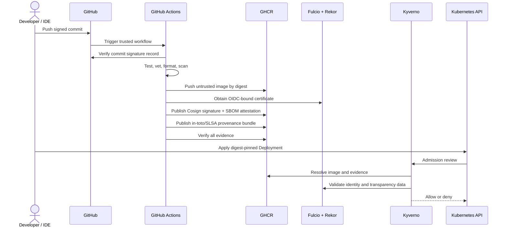

# Architecture

## Design goal

ChainShield ensures that the image admitted into the demo namespace is the same immutable artifact produced by the trusted GitHub workflow and that the artifact carries verifiable evidence. The trust decision is made from signatures, identities, predicates, and digests—not from a mutable image tag.

## Components

| Component | Responsibility |
|---|---|
| Developer Git client/IDE | Creates an SSH- or GPG-signed commit |
| GitHub | Verifies the developer signature and protects `main` |
| Pull-request workflow | Tests code, verifies all PR commits, runs CodeQL and OPA policy tests |
| Trusted supply-chain workflow | Builds, scans, signs, attests, and verifies the image |
| GHCR | Stores the image, Cosign signature, SBOM attestation, and provenance bundle |
| Fulcio | Binds an ephemeral signing key to GitHub's OIDC workflow identity |
| Rekor | Records the signing event in a transparency log |
| Kyverno | Performs fail-closed verification during Kubernetes admission |
| Gatekeeper | Optionally enforces repository and immutable digest structure |

## End-to-end sequence



## Why an image is pushed before it is signed

OCI signatures and attestations are attached to an existing artifact digest, so the pipeline must publish the image before it can sign that digest. The interval is safe under this project's policy because the image remains **untrusted and undeployable** until all scans pass and the expected evidence is attached. Registry retention rules should later remove failed, unsigned builds.

## Trust roots

The admission decision relies on:

1. the Sigstore public-good trust root;
2. GitHub Actions' OIDC issuer, `https://token.actions.githubusercontent.com`;
3. the exact repository and workflow identity encoded in the Fulcio certificate;
4. the allowed Git ref (`main` or a semantic-version tag);
5. the image's immutable `sha256` digest;
6. the SLSA v1 predicate and GitHub workflow build type;
7. the Kyverno policy and webhook being present and fail closed.

Changing the repository name, workflow path, branch, issuer, or predicate intentionally requires a policy update and review.

## Data and evidence

### Image signature

The Cosign signature answers: **Which workload identity signed this exact image digest?**

### SPDX SBOM attestation

The SBOM answers: **Which packages/files were observed in this exact image?** The attestation signature prevents undetected substitution of the SBOM predicate.

### SLSA provenance

The provenance answers: **Which builder and workflow invocation produced this digest, from which source context?** GitHub's action creates a Sigstore-signed in-toto Statement with the SLSA provenance predicate.

## Deployment decision

A deployment is accepted only when both Kyverno policies succeed:

```text
trusted image signature
AND trusted GitHub OIDC issuer
AND expected repository/workflow/ref identity
AND valid SLSA v1 provenance
AND expected build type
AND exact digest binding
```

OPA/Conftest catches policy mistakes before merge. Gatekeeper can reinforce digest pinning, but cryptographic evidence verification remains Kyverno's responsibility in the default design.
